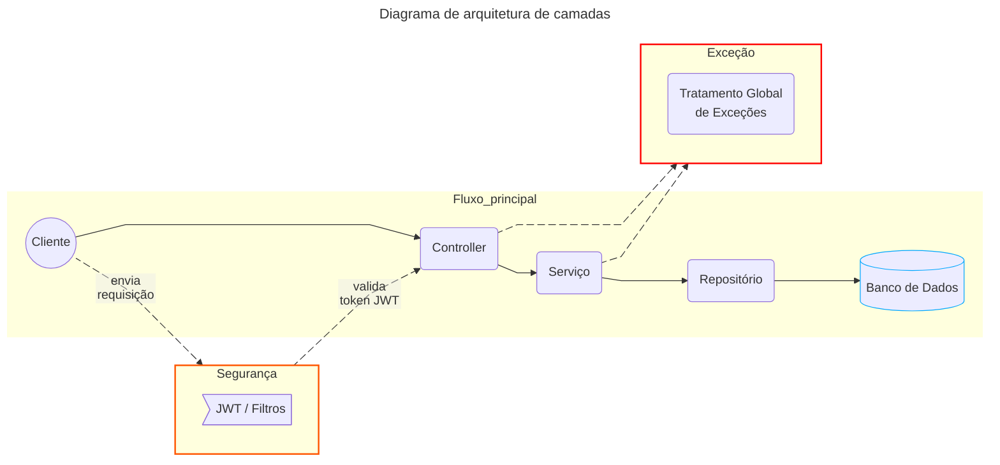

<h1 align="center">Service Desk API</h1>

<p align="center">API REST para gerenciamento de chamados desenvolvida com <b>Java 17</b> e <b>Spring Boot 3</b>.</p>
<p align="center">O projeto demonstra a implementação de autenticação JWT, arquitetura em camadas, monitoramento com Spring Boot Actuator, documentação OpenAPI e empacotamento para produção utilizando Docker com multi-stage build.</p>

<p align="center">
	
	
</p>
<p align="center">
	
</p>

<br>

<details>
	<summary>📚 <b> Table of Contents </b> </summary>

- [Arquitetura](#arquitetura)
- [Tecnologias](#tecnologias)
- [Principais recursos](#principais-recursos)
- [Execução](#execução)
- [Segurança](#segurança)
- [Swagger](#swagger)
- [Testes](#testes)
- [Informações operacionais](#informações-operacionais)
- [Perfis de ambiente](#perfis-de-ambiente)
- [Objetivo](#objetivo)

</details>

## Arquitetura

A aplicação adota uma arquitetura em camadas, separando responsabilidades entre apresentação, regras de negócio e persistência.

Abaixo a representação visual do diagrama de arquitetura.


### Responsabilidades das camadas

- **[Controller](src/main/java/service_desk_api/api/controller)** – expõe os endpoints REST e valida os dados de entrada.
- **[Service](src/main/java/service_desk_api/api/service)** – concentra as regras de negócio e orquestra o fluxo da aplicação.
- **[Repository](src/main/java/service_desk_api/api/repository)** – realiza o acesso aos dados com Spring Data JPA.
- **[Model](src/main/java/service_desk_api/api/model)** – representa as entidades persistidas e o estado do domínio.
- **[DTO](src/main/java/service_desk_api/api/dto)** – define os dados de entrada e saída da API.
- **[Config](src/main/java/service_desk_api/api/config)** – reúne configurações de segurança (Spring Security, JWT e filtros), OpenAPI e beans.
- **[Exception Handler](src/main/java/service_desk_api/api/exception)** – centraliza o tratamento de exceções e a padronização das respostas.

A autenticação e a autorização são tratadas transversalmente pelo Spring Security e pelos filtros JWT. Model e DTO não aparecem no fluxo principal do diagrama porque representam estruturas de dados, e não etapas de processamento da requisição.

## Tecnologias

- Java 17
- Spring Boot 3
- Spring Data JPA
- Spring Security
- Spring Boot Actuator
- JWT (jjwt)
- H2 Database
- Lombok
- Springdoc OpenAPI (Swagger)
- JUnit 5
- Mockito
- Docker
- Maven

## Principais recursos

- CRUD completo de chamados
- Autenticação stateless com JWT
- Controle de acesso por perfis `USER` e `ADMIN`
- Validação de entrada com Jakarta Validation
- Tratamento global de exceções
- Padronização das respostas da API
- Documentação interativa com Swagger e OpenAPI
- Informações operacionais e de build com Spring Boot Actuator
- Perfis separados para desenvolvimento e produção
- Empacotamento com Docker multi-stage e execução como usuário não-root

## Execução

### Pré-requisitos

Escolha uma das formas de execução:

- **Maven:** Java 17
- **Docker:** Docker Engine ou Docker Desktop

### Clonar o projeto

```bash
git clone https://github.com/IgorVHau/service-desk-api.git
cd service-desk-api
```

### Executar com Maven

| Sistema Operacional | Comando |
|:----------:|:----------|
|Linux, macOS ou Git Bash|`./mvnw spring-boot:run`|
|Windows|`mvnw.cmd spring-boot:run`|


### Executar com Docker

Construa a imagem:

```bash
docker build -t service-desk-api .
```

Execute o container:

```bash
docker run -d --name service-desk-api-container -p 8080:8080 service-desk-api
```

A imagem utiliza multi-stage build e contém apenas o ambiente de execução e o artefato da aplicação. O processo Java é executado por um usuário sem privilégios de root.

Visualize os logs:

```bash
docker logs -f service-desk-api-container
```

Interrompa e remova o container:

```bash
docker stop service-desk-api-container
docker rm service-desk-api-container
```

### Endereços locais

| Recurso | Endereço |
|---|---|
| API | `http://localhost:8080` |
| Swagger UI | `http://localhost:8080/swagger-ui/index.html` |
| OpenAPI JSON | `http://localhost:8080/v3/api-docs` |

## Segurança

A API utiliza autenticação baseada em **JWT (JSON Web Token)** para proteger seus endpoints, com filtro de segurança customizado e integração com Swagger para autorização via token.

É necessário autenticar o usuário por meio de login e senha. Caso contrário, todas as operações serão bloqueadas.

> [!NOTE] 
> As credenciais abaixo são fictícias e destinadas exclusivamente à execução local:

| Usuário | E-mail | Senha | Perfil |
|:-------:|:-------:|:-------:|:-------:|
| Jorge | `user@email.com` | `654321` | `USER` |
| Fernando | `admin@email.com` | `123456` | `ADMIN` |

### Fluxo de autenticação

1. Envie uma requisição **POST** para `/auth/login`.
2. Envie no corpo da requisição um JSON contendo os campos `email` e `senha` utilizando uma das credenciais da tabela acima.
3. Após a autenticação bem-sucedida, a API retornará um **token JWT** conforme ilustrado abaixo.

<p align="center">
	
</p>

4. Nas requisições seguintes, envie o token no header `Authorization` utilizando o formato `Bearer <token>`.

<p align="center">
	
</p>

> [!NOTE]
> O token é válido por 1 hora. Após sua expiração, uma nova autenticação deve ser realizada.


## Swagger

A API disponibiliza uma documentação interativa por meio do Swagger UI e uma especificação OpenAPI em formato JSON.

Por meio do Swagger UI, é possível:
- consultar endpoints, contratos e schemas;
- autenticar-se com JWT;
- executar requisições diretamente pelo navegador;
- visualizar os formatos esperados de requisição e resposta.

Exemplo da interface do Swagger UI:

<p align="center">
	
</p>

## Testes

O projeto utiliza JUnit 5, Mockito e MockMvc em dois níveis:

- **[Testes unitários de serviço](src/test/java/service_desk_api/api/service/ChamadoServiceTest.java):** validam as regras de negócio com dependências simuladas.
- **[Testes da camada Web](src/test/java/service_desk_api/api/controller/ChamadoControllerTest.java):** validam status HTTP, respostas JSON e tratamento de exceções.

Execute todos os testes com:

```bash
./mvnw test
```

No Windows:

```powershell
mvnw.cmd test
```

## Informações operacionais

A aplicação utiliza o **Spring Boot Actuator** para expor informações operacionais e metadados de build.

| Método HTTP | Endpoint | Permissão |
|:----------:|:----------|:----------|
| `GET` | `/actuator/info` | `ADMIN` 🔐 |

Exemplo de informações expostas:

- Nome e versão da aplicação
- Dados de build (artifact, versão, data)
- Metadados do Git (branch, commit, timestamp)

Essas informações são obtidas a partir da configuração do [pom.xml](pom.xml) e do repositório Git.


## Perfis de ambiente

| Perfil | Banco de dados | Finalidade |
|---|---|---|
| [`dev`](src/main/resources/application-dev.yml) | H2 em memória | Desenvolvimento local, logs SQL e criação automática do schema |
| [`prod`](src/main/resources/application-prod.yml) | PostgreSQL externo | Configuração próxima de produção, credenciais por variáveis de ambiente e validação do schema |


## Objetivo
Desenvolver uma API REST completa para aplicar, de forma prática, conceitos de arquitetura em camadas, segurança com JWT, testes automatizados, documentação OpenAPI, informações operacionais e containerização no ecossistema Spring.
